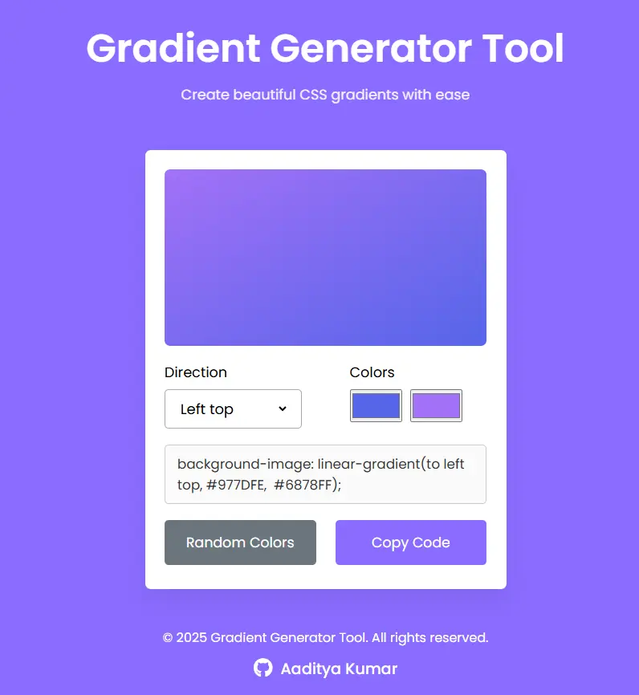

# Gradient Generator Tool 🎨

A simple and elegant web-based tool that helps you create beautiful CSS gradients with ease. Generate, customize, and copy gradient code with just a few clicks.



## Features ✨

- **Interactive Gradient Preview**: Real-time visualization of your gradient
- **Direction Control**: Choose from 8 different gradient directions
- **Color Customization**: Pick custom colors using color pickers
- **Random Generation**: Generate random gradient combinations
- **Copy to Clipboard**: Easy one-click code copying
- **Responsive Design**: Works seamlessly on both desktop and mobile devices

## Technologies Used 🛠️

- HTML5
- CSS3
- Vanilla JavaScript
- Font Awesome Icons
- Google Fonts (Poppins)

## Usage 💡

1. **Select Gradient Direction**:
   - Choose from various directions (Top, Right top, Right, etc.)
   - The gradient preview updates automatically

2. **Choose Colors**:
   - Use the color pickers to select your desired colors
   - The gradient updates in real-time as you pick colors

3. **Generate Random Gradients**:
   - Click the "Random Colors" button to generate random color combinations

4. **Copy CSS Code**:
   - Click the "Copy Code" button to copy the CSS code to your clipboard
   - Paste it directly into your project

## Installation 🚀

1. Clone the repository:
   ```bash
   git clone https://github.com/AadityaGeek/gradient-generator.git
   ```

2. Open `index.html` in your web browser

No additional setup or dependencies required!

## Local Development 💻

To run this project locally:

1. Download or clone the repository
2. Open the project folder in your code editor
3. Launch `index.html` with a live server or directly in your browser

## Contributing 🤝

Contributions are welcome! Feel free to:

1. Fork the repository
2. Create your feature branch (`git checkout -b feature/AmazingFeature`)
3. Commit your changes (`git commit -m 'Add some AmazingFeature'`)
4. Push to the branch (`git push origin feature/AmazingFeature`)
5. Open a Pull Request

## License 📝

This project is open source and available under the MIT License.

## Author ✍️

- **Aaditya Kumar** - [GitHub Profile](https://github.com/AadityaGeek)

## Acknowledgments 🙏

- Inspired by modern gradient tools
- Icons provided by Font Awesome
- Fonts by Google Fonts

---

Feel free to star ⭐ this repository if you find it helpful!